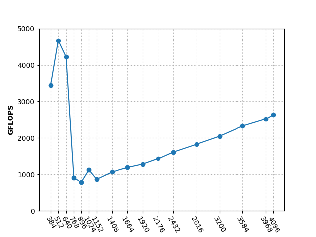

# Implementation and Optimization of Matrix Multiplication on CUDA

This is a summer intern project in Advanced Computer Architecture Lab, SJTU. I implemented matrix multiplication on CUDA-8.0 based on **five** different method. Some of the methods archieved almost the same performance as cuBLAS.

## Device Properties
Name:  GeForce GTX 1080 Ti

Compute capability:  6.1

## Methods
All the methods are based on the basic multiplication method, whose **time complexity** is O(N<sup>3</sup>). So the optimization focused on low level method, such as reduce the accession in global memory and the number of instructions.

The key idea for CUDA programming is properly assigning work to each threads. Then consider the grid size and block size according to specific matrix size.

We use **GFLOPS** to measure the performance of different methods. In computing, **floating point operations per second(FLOPS)** is a measure of computer performance. It is also commonly used in researches about matrix multiplication on GPU. 

Consider matrix multiplication: A(MxK) x B(KxN) = C(MxN). If the time spent on computing is ``t``, the **GFLOPS** is:

``2xMxKxN / t / 1e9``

In the experiment, I evaluate GFLOPS with different size of matrix.

### Benchmark(cuBLAS)
The perforamce of cuBLAS is as follows:



## Miscellaneous

Compile the file as follows:

```
nvcc *.cu --std=c++11
```

